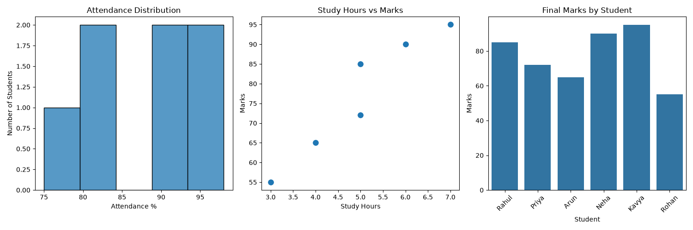
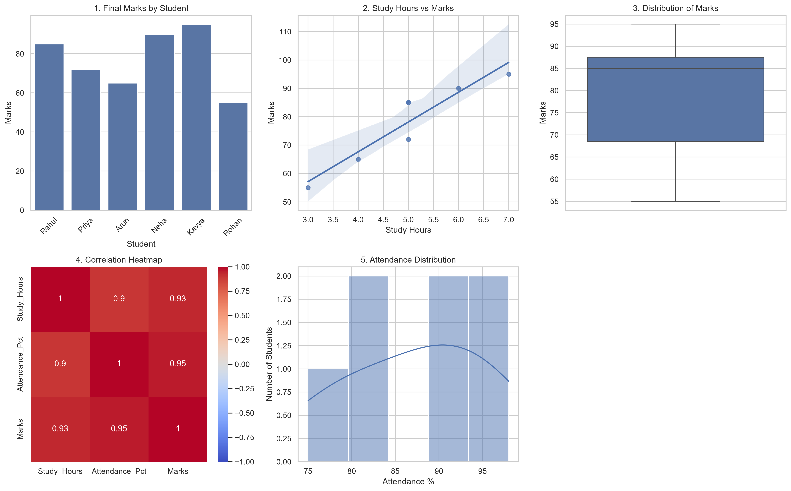
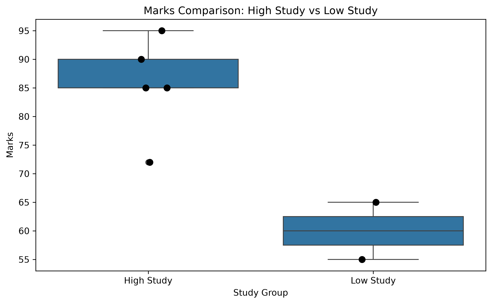
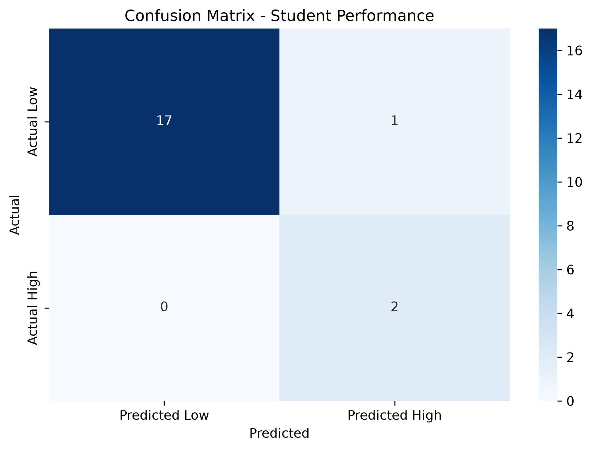

# 📊 Student Performance Analysis & Prediction

> **YuvaIntern — Virtual Data Science with Python Apprentice Internship Project**

An end-to-end Data Science project that analyzes student academic performance using **Python, Pandas, Matplotlib, Seaborn, SciPy, and Scikit-learn**.

The project follows a practical data-science workflow:

**Raw Data → Data Cleaning → EDA → Visualization → Statistical Testing → Machine Learning → Evaluation → Recommendations**

---

## 📌 Project Overview

This project was completed as part of the **YuvaIntern Virtual Data Science with Python Apprentice Internship**.

The main objective was to study how **Study Hours** and **Attendance Percentage** relate to **student marks**, and then demonstrate how these insights can be extended into statistical analysis and predictive modeling.

The project was developed progressively over five weeks:

| Week | Focus | Main Work |
|---|---|---|
| **Week 1** | Data Cleaning & Exploration | Missing values, duplicates, basic statistics, initial visualizations |
| **Week 2** | Data Storytelling & Visualization | Dashboard, correlations, distributions, trend analysis |
| **Week 3** | Hypothesis Testing | High/Low study groups and Independent Samples T-Test |
| **Week 4** | Machine Learning | Logistic Regression and student-performance classification |
| **Week 5** | Final Integration | End-to-end analysis, interpretation, recommendations and limitations |

---

## 🎯 Objectives

- Clean and prepare a raw student dataset.
- Handle missing values using appropriate statistical methods.
- Identify and interpret duplicate records.
- Perform exploratory data analysis (EDA).
- Visualize student performance and attendance patterns.
- Measure correlations between study hours, attendance and marks.
- Test whether high-study and low-study groups have significantly different average marks.
- Build a binary classification model for high-performance students.
- Evaluate the model using accuracy, precision, recall and a confusion matrix.
- Document limitations and propose future improvements.

---

## 🗂️ Dataset

The original dataset contains these fields:

- `Student_ID`
- `Name`
- `Study_Hours`
- `Attendance_Pct`
- `Marks`

### Data Cleaning

The raw dataset contained 8 records. After cleaning, **7 valid records** remained.

Cleaning operations included:

1. Checking exact duplicate rows with `drop_duplicates()`.
2. Filling missing `Study_Hours` with the column median.
3. Filling missing `Attendance_Pct` with the column mean.
4. Removing the record with missing `Marks`, because marks are the primary outcome variable.

The two Rahul records were retained because their `Student_ID` values were different, meaning they were not exact duplicate rows.

---

## 📈 Exploratory Data Analysis

The cleaned dataset produced the following key statistics:

| Metric | Result |
|---|---:|
| Valid records | 7 |
| Average mark | 78.1 |
| Median mark | 85 |
| Highest mark | 95 |
| Lowest mark | 55 |

The highest mark was achieved by **Kavya (95)**, while the lowest was **Rohan (55)**.

---

## 📊 Visualizations

### Week 1 — Initial Analysis

The first analysis generated:

- Attendance Distribution
- Study Hours vs Marks
- Final Marks by Student



---

### Week 2 — Visualization Dashboard

The dashboard contains five visualizations:

1. Final Marks by Student
2. Study Hours vs Marks
3. Distribution of Marks
4. Correlation Heatmap
5. Attendance Distribution



### Key Correlations

| Variables | Correlation |
|---|---:|
| Study Hours ↔ Marks | **0.93** |
| Attendance ↔ Marks | **0.95** |
| Study Hours ↔ Attendance | **0.90** |

These values indicate strong positive associations within this small dataset. They should **not** be interpreted as proof of causation.

---

## 🧪 Statistical Analysis

Students were divided into two groups:

- **High Study:** `Study_Hours >= 5`
- **Low Study:** `Study_Hours < 5`

An **Independent Samples T-Test** was performed using `scipy.stats.ttest_ind`.

### Results

| Metric | High Study | Low Study |
|---|---:|---:|
| Sample Size | 5 | 2 |
| Mean Marks | 85.40 | 60.00 |

**T-statistic:** `3.6643`  
**P-value:** `0.0145`  
**Significance level:** `α = 0.05`

Since `p = 0.0145 < 0.05`, the null hypothesis was rejected. The observed difference between the two groups is statistically significant within this sample.



> ⚠️ **Important:** The sample contains only 7 observations and the groups are highly unbalanced (5 vs. 2). Therefore, the result is a suggestive pattern in this dataset rather than a general conclusion about students.

---

## 🤖 Machine Learning

The real dataset contained only 7 observations, which is too small for meaningful machine-learning training and evaluation.

Therefore, Week 4 used a **synthetically generated dataset of 100 simulated students** to demonstrate the ML workflow.

### Features

- `Study_Hours`
- `Attendance_Pct`

### Target

`High_Performance`

- `1` → Marks ≥ 75
- `0` → Marks < 75

### Model

**Logistic Regression**

### Train/Test Split

- Training: 80%
- Testing: 20%
- `random_state = 42`
- Stratified split

### Model Results

| Metric | Score |
|---|---:|
| Accuracy | **90.0%** |
| Precision | **100.0%** |
| Recall | **33.3%** |



### Confusion Matrix

| Actual / Predicted | Low | High |
|---|---:|---:|
| **Low** | 17 | 0 |
| **High** | 2 | 1 |

The model produced **zero false positives**, but it missed 2 of the 3 actual high performers in the test set.

This means the 90% accuracy should not be viewed alone. The synthetic dataset was imbalanced, with only 10% of simulated students classified as high performers, which strongly affects interpretation.

---

## 🛠️ Technologies Used

- **Python**
- **Pandas** — data loading, cleaning and manipulation
- **NumPy** — numerical operations and synthetic data generation
- **Matplotlib** — visualization
- **Seaborn** — statistical visualization
- **SciPy** — hypothesis testing
- **Scikit-learn** — machine learning and model evaluation
- **Jupyter Notebook / Python scripts**
- **Git & GitHub** — version control and project publishing

---

## 📁 Recommended Repository Structure

```text
student-performance-analysis/
│
├── README.md
├── requirements.txt
├── student_data.csv
│
├── week1_analysis.py
├── week2_visuals.py
├── week3_testing.py
├── week4_machine_learning.py
│
├── week1_graphs.png
├── week2_dashboard.png
├── week3_hypothesis_test.png
├── week4_confusion_matrix.png
│
├── reports/
│   ├── Week1_Report.docx
│   ├── Week2_Report.docx
│   ├── Week3_Report.docx
│   ├── Week4_Report.docx
│   └── Week5_Final_Report.docx
│
└── certificate/
    └── YUVAINTERN_certificate.pdf
```

---

## ⚙️ Installation

Clone the repository:

```bash
git clone https://github.com/YOUR-USERNAME/student-performance-analysis.git
cd student-performance-analysis
```

Create a virtual environment:

```bash
python -m venv venv
```

Activate it on Windows:

```bash
venv\Scripts\activate
```

Install dependencies:

```bash
pip install -r requirements.txt
```

---

## ▶️ Running the Project

### Week 1

```bash
python week1_analysis.py
```

### Week 2

```bash
python week2_visuals.py
```

### Week 3

```bash
python week3_testing.py
```

### Week 4

```bash
python week4_machine_learning.py
```

Make sure `student_data.csv` is in the same working directory as the scripts.

---

## 🔬 Project Workflow

```text
                 RAW STUDENT DATA
                        │
                        ▼
                ┌───────────────┐
                │ Data Cleaning │
                └───────┬───────┘
                        │
                        ▼
               ┌─────────────────┐
               │ Exploratory EDA │
               └────────┬────────┘
                        │
                        ▼
              ┌───────────────────┐
              │ Data Visualization │
              └─────────┬─────────┘
                        │
                        ▼
              ┌───────────────────┐
              │ Statistical Test  │
              │   Independent     │
              │     T-Test        │
              └─────────┬─────────┘
                        │
                        ▼
              ┌───────────────────┐
              │ Synthetic Dataset │
              │   for ML Demo     │
              └─────────┬─────────┘
                        │
                        ▼
                ┌──────────────┐
                │  Logistic    │
                │  Regression  │
                └──────┬───────┘
                       │
                       ▼
              ┌──────────────────┐
              │ Model Evaluation │
              │ Accuracy/Precision│
              │ Recall/Confusion │
              └──────────────────┘
```

---

## 💡 Key Findings

1. Study hours and marks showed a strong positive correlation of **0.93**.
2. Attendance and marks showed a strong positive correlation of **0.95**.
3. Study hours and attendance showed a correlation of **0.90**.
4. Students studying 5+ hours had a mean mark of **85.40**, compared with **60.00** for students studying less than 5 hours.
5. The t-test produced a **p-value of 0.0145**, indicating a statistically significant difference within this sample.
6. The Logistic Regression demonstration achieved **90% accuracy** and **100% precision**, but recall was only **33.3%**.
7. The ML dataset was synthetic and should not be treated as evidence about real students.

---

## ⚠️ Limitations

- The real dataset contains only 7 valid observations.
- The statistical groups contain only 5 and 2 observations.
- The original data is observational, so correlation does not establish causation.
- The machine-learning dataset is synthetic.
- The synthetic ML dataset is imbalanced.
- Only two features were used for prediction.
- A single train/test split was used.
- ML results cannot be generalized to a real student population.

---

## 🚀 Future Improvements

Future versions of the project can:

- Collect hundreds or thousands of real student records.
- Add features such as previous grades, assignment scores, participation and study patterns.
- Compare Logistic Regression with Decision Trees, Random Forest and Gradient Boosting.
- Use cross-validation for more reliable evaluation.
- Apply class-imbalance techniques such as class weighting or resampling.
- Build an interactive dashboard using Streamlit or Power BI.
- Deploy the predictive model as a web application.
- Add an early-warning system that supports human decision-making rather than replacing it.

---

## 📜 Internship

This project was completed during the **YuvaIntern Virtual Data Science with Python Apprentice Internship**.

The internship certificate confirms successful completion of the program in this role.

---

## 👨‍💻 Author

**Prithviraj Pol**

**Domain:** Data Science / Artificial Intelligence & Data Science

---

## 📄 Project Reports

The repository includes the complete weekly documentation:

- Week 1 — Data Cleaning and Exploration
- Week 2 — Data Storytelling and Visualization
- Week 3 — Hypothesis Testing and Statistical Analysis
- Week 4 — Predictive Modeling and Machine Learning
- Week 5 — Final Project Report

---

## ⭐ Acknowledgement

Thanks to **YuvaIntern** for providing the internship opportunity and a structured environment to practice the end-to-end Data Science workflow.

---

## ⚖️ Disclaimer

This project is primarily an **educational internship project**.

The statistical findings are based on a very small observational dataset, while the machine-learning experiment uses synthetic data. The results are intended to demonstrate data-science methods and should not be used to make decisions about real students without a substantially larger, representative and properly validated dataset.
